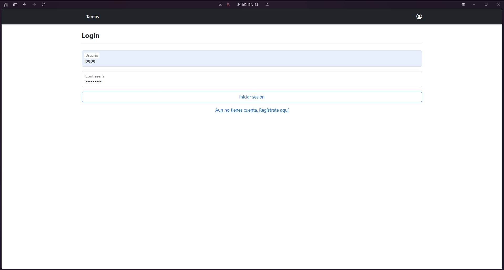

# Despliege Gestor de Tareas

## Descripción

Este proyecto es un gestor de tareas que permite a los usuarios crear, editar y eliminar tareas. Además, permite a los usuarios marcar las tareas como completadas o pendientes, esta web se compone de el frontend con Angular y el backend con FastAPI.

En esta guía se explicará cómo desplegar el gestor de tareas en un servidor de producción.

## Requisitos

- Docker
- Docker Compose

## Despliegue

En primer lugar, clonamos los repositorios del frontend y del backend en el servidor de producción.

Esto se puede hacer con el siguiente comando:

Frontend:
```bash
git clone https://github.com/ArturoCarrilloJimenez/fronted-Gestor-de-Tareas.git
```

Backend:
```bash	
git clone https://github.com/ArturoCarrilloJimenez/Api-Gestor-de-Tareas/tree/main
```

### Despliegue de FastAPI

Una vez clonados los repositorios entra en la carpeta del backend y crearemos un ``Dockerfile`` siguindo los siguientes pasos:

1. Creamos un archivo llamado ``Dockerfile`` en la carpeta del backend.

2. Dentro del archivo ``Dockerfile`` elegimos la imagen base de Docker, en este caso utilizaremos la imagen de Python 3.8.

```Dockerfile
FROM python:3.9
```

3. Añadimos el directorio de trabajo.

```Dockerfile
WORKDIR /code
```

4. Copiamos el archivo ``requirements.txt`` a la imagen de Docker.

```Dockerfile
COPY ./requirements.txt /code/requirements.txt
```

5. Instalamos las dependencias.

```Dockerfile
RUN pip install --no-cache-dir --upgrade -r /code/requirements.txt
```

6. Copiamos el código fuente a la imagen de Docker.

```Dockerfile
COPY . /code
```

7. Exponemos el puerto 8000.

```Dockerfile
EXPOSE 8000
```

8. Ejecutamos el servidor de FastAPI.

```Dockerfile
CMD ["uvicorn", "app.main:app", "--host", "0.0.0.0", "--port", "8000"]
```

Siguiendo estos pasos, ya tendriamos una imagen de Docker con el backend de FastAPI.

Si necesitas más información sobre cómo crear una imagen de Docker, puedes consultar la documentación oficial de Docker: [Crear una imagen de Docker](https://docs.docker.com/engine/reference/builder/).

Ademas en la web de FastAPI puedes encontrar más información sobre como desplegar FastAPI en un dockerfile: [Despliegue de FastAPI](https://fastapi.tiangolo.com/deployment/docker/#container-images).

### Despliegue de Angular

Una vez clonados los repositorios entra en la carpeta del frontend y crearemos un ``Dockerfile`` siguindo los siguientes pasos:

1. Creamos un archivo llamado ``Dockerfile`` en la carpeta del frontend.

2. Dentro del archivo ``Dockerfile`` elegimos la imagen base de Docker, en este caso utilizaremos la imagen de Node.

```Dockerfile
FROM node:latest AS build
```

3. Añadimos el directorio de trabajo.

```Dockerfile
WORKDIR /app
```

4. Copiamos el archivo ``package.json`` a la imagen de Docker.

```Dockerfile
COPY package.json /app
```

5. Instalamos las dependencias.

```Dockerfile
RUN npm install
```

6. Copiamos el código fuente a la imagen de Docker.

```Dockerfile
COPY . /app
```

7. Construimos la aplicación Angular.

```Dockerfile
RUN npm run build --prod
```

8. Elegimos la imagen base de Nginx.

```Dockerfile
FROM nginx:latest
```

9. Elegir el directorio de trabajo.

```Dockerfile
WORKDIR /usr/share/nginx/html/
```

10. Copiamos los archivos de la aplicación Angular a la imagen de Docker.

```Dockerfile
COPY --from=build /app/dist/gestor-tareas-angular/browser ./
```

11. Exponemos el puerto 80.

```Dockerfile
EXPOSE 80
```

Siguiendo estos pasos, ya tendriamos una imagen de Docker con el frontend de Angular.

Si necesitas ayada para esto puedes consultar la la siguintte web: [Crear una imagen de Angular con nginx](https://dev.to/rodrigokamada/creating-and-running-an-angular-application-in-a-docker-container-40mk).

### Docker Compose

Una vez creadas las imágenes de Docker, podemos utilizar Docker Compose para desplegar el frontend y el backend en el servidor de producción.

Para ello, creamos un archivo llamado ``docker-compose.yml`` en la carpeta raíz del proyecto.

Este archivo contendrá la configuración de Docker Compose para desplegar el frontend, el backend y una base de datos.

```yml
services:
  fastapi:
    build: ./Api-Gestor-de-Tareas
    container_name: fastapi_app
    ports:
      - "8000:8000"
    restart: always

  angular:
    build: ./fronted-Gestor-de-Tareas
    container_name: angular_app
    ports:
      - "80:80"
    restart: always

  db:
    image: mysql:8.0
    container_name: fastapi_db
    restart: always
    environment:
      MYSQL_ROOT_PASSWORD: ${MYSQL_ROOT_PASSWORD}
      MYSQL_DATABASE: ${MYSQL_DATABASE}
      MYSQL_USER: ${MYSQL_USER}
      MYSQL_PASSWORD: ${MYSQL_PASSWORD}
    ports:
      - "3306:3306"
```

En este archivo de configuración, se definen tres servicios:

- ``fastapi``: Servicio de FastAPI.
- ``angular``: Servicio de Angular.
- ``db``: Servicio de la base de datos MySQL.

Con esta configuración, Docker Compose creará y ejecutará los contenedores de Docker para el frontend, el backend y la base de datos.

Si todo ha ido bien, ya tendríamos el gestor de tareas desplegado en el servidor de producción.

Para comprobar que todo funciona correctamente, podemos acceder a la dirección IP del servidor en un navegador web.

